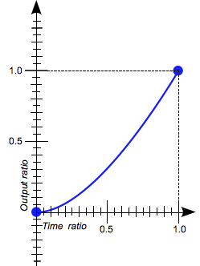
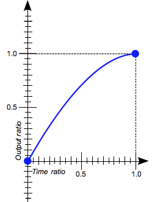
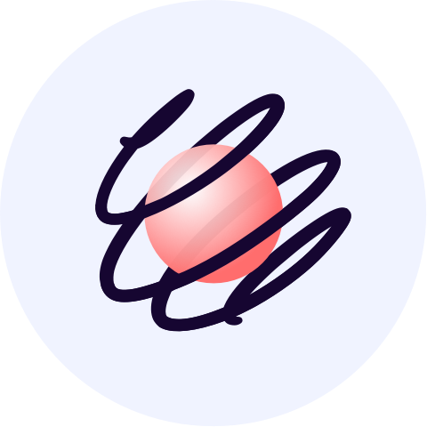

import { Flex, Box, Text } from '@rebass/emotion';
import { Split, FullScreenCode } from 'mdx-deck/layouts';
import { Head } from 'mdx-deck'
export { theme } from './components/theme';
import { ReactLogo } from './components/ReactLogo';
import { Tweet } from './components/Tweet';
import { Layout, ThemeGlobal } from './components/theme';
import { Reference } from './components/Reference';
import { BasicAnimation } from './components/BasicAnimation';
import { AnimatingProperties } from './components/AnimatingProperties';
import { BezierCurveDevtools } from './components/BezierCurveDevtools';
import { Keyframes } from './components/Keyframes';
import { SlideCss } from './components/SlideCss';
import { SlideSpring } from './components/SlideSpring';
import { SpringPresets } from './components/SpringPresets';
import { UnmountAnimation } from './components/UnmountAnimation';
import { AutoAnimation } from './components/AutoAnimation';
import { TrailAnimation } from './components/TrailAnimation';
import { ChainAnimation } from './components/ChainAnimation';
import { Zdog } from './components/Zdog';
import { Three } from './components/Three';
import { Analytics } from './components/Analytics';
import { Video } from './components/Video';

<ThemeGlobal />

<ReactLogo/>

# Animating React

[https://talk-tlp-2019.axelhzf.com](https://talk-tlp-2019.axelhzf.com)

Axel Hernández Ferrera ([@axelhzf](https://twitter.com/axelhzf))

---

# Agenda

- Why animation matters?
- CSS Animations
- Spring Based Animations

---

# Disclaimer:

## I am not a motion designer

---

## Why native apps feels better than webs?

---

<Split>

# Animations using SwiftUI

<Tweet tweetId="1142539362875392001" />

</Split>

---

<Split>

<Tweet tweetId="1145465025194332165" />

# The tools for native animations are superior

</Split>

---

# Why animation matters?

---

<Split>

# Animations can make objects feel more natural

<Video src="assets/scroll.mp4" style={{ height: '90vh' }}/>

</Split>


---

<Split>

# Motion can show how elements are related

<Video src="assets/relation.mp4" style={{ height: '90vh' }}/>

</Split>

---

<Split>

# Motion focuses attention on what's important

<Video src="assets/feedback-password.mp4" style={{ height: '90vh' }}/>

<Reference href="https://material.io/design/motion/#usage">Material Guideline</Reference>

</Split>

---

# Where to start?

---

# Use the platform

<Reference href="https://dev.to/richharris/why-i-don-t-use-web-components-2cia">
  Why I don't use web components by Rich Harris
</Reference>

---

# CSS Animations

---

# CSS Transitions

    div {
        transition:
            <property>
            <duration>
            <timing-function>
            <delay>
        ;
    }

---

# CSS Transitions

<BasicAnimation />

---

# Animated Properties

<AnimatingProperties />

<Reference href="https://developer.mozilla.org/en-US/docs/Web/CSS/CSS_animated_properties">
  CSS Animated Properties
</Reference>

---

# Timing functions

<Flex>
<Flex flexDirection="column">


linear

</Flex>

<Flex flexDirection="column">


ease

</Flex>
<Flex flexDirection="column">



ease-in

</Flex>
<Flex flexDirection="column">



ease-out

</Flex>
<Flex flexDirection="column">


ease-in-out

</Flex>
</Flex>

<Reference href="https://developer.mozilla.org/en-US/docs/Web/CSS/timing-function">
  MDN Timing Functions
</Reference>

---

# cubic-bezier

A Bézier curve is a parametric curve used to model smooth curves


<br/>
<br/>


<Reference href="https://en.wikipedia.org/wiki/B%C3%A9zier_curve#Cubic_B.C3.A9zier_curves">
  Bezier Curves in Wikipedia
</Reference>

---

# ease-in-out


    cubic-bezier(0.42, 0.0, 0.58, 1.0)

---

# Cubic-bezier playground

https://cubic-bezier.com

---

# Devtools

<BezierCurveDevtools />

---

<Flex width="100vw" p="1em" flexDirection="column">

# Keyframes animations

<Flex width="100%">

<Box width={500}>
  <Keyframes />
</Box>

<Box flex="1" fontSize="70%">

```css
@keyframes fancy {
  0%,
  100% {
    transform: translateX(0) translateY(0);
    opacity: 1;
  }
  25% {
    transform: translateX(300px) translateY(0);
  }
  50% {
    transform: translateX(300px) translateY(300px);
    opacity: 0.5;
  }
  75% {
    transform: translateX(0) translateY(300px);
  }
}
div {
  animation: fancy 4s ease-in-out infinite;
}
```

</Box>

</Flex>
</Flex>

---

# Keyframes are powerful

[https://codepen.io/davidkpiano/pen/kkpGWj](https://codepen.io/davidkpiano/pen/kkpGWj)

---

# Web Animations API

```javascript
var keyframes = [{ opacity: 0 }, { opacity: 1 }];
element.animate(keyframes, 1000);
```

<Reference href="https://css-tricks.com/css-animations-vs-web-animations-api/">
  CSS Animations vs Web Animations API
</Reference>

---

# User interactions

<SlideCss />

<Box mt="1em">

```css
transition: linear 1000ms;
```

</Box>

---

<Split>

# Animations based on durations have limitations

<Tweet tweetId="566736015188963328" />

</Split>

---


<Video src="assets/carbonMotionDuration.mp4"/>

<Reference href="https://www.carbondesignsystem.com/guidelines/motion/basics#duration">
  IBM Carbon Design System Motion
</Reference>

---

# IBM Motion Generator

https://ibm.github.io/motion/

🤦‍♂️

---

# User interactions

<SlideSpring />

---

# Spring based animations

[Cheng Lou - the state of animation in React](https://www.youtube.com/watch?v=1tavDv5hXpo)

---

# Spring based animations

- Give me the final value
- I know the current momentum
- Conserve the current animation's speed for me
- Here the stiffness, damping and mass of this thing

<Reference href="https://www.youtube.com/watch?v=1tavDv5hXpo">
  The state of animation in React
</Reference>

---

# Spring Physics

Hooke’s law expresses how springs extends and contract


The force is proportional to the extension

<Reference href="https://en.wikipedia.org/wiki/Hooke%27s_law#For_linear_springs">
  Hooke's law Wikipedia
</Reference>

---

# Spring Physics

There’s also this damping force which slows down the motion.

<Text fontWeight="600">
Ff = −cv
</Text>

<Reference href="https://en.wikipedia.org/wiki/Damping_ratio#Example:_mass.E2.80.93spring.E2.80.93damper">
  Dumping Force Wikipedia
</Reference>

---

# Spring Physics


<Reference href="https://en.wikipedia.org/wiki/Harmonic_oscillator#Damped_harmonic_oscillator">
  Harmonic Oscillator Wikipedia
</Reference>

---

<Layout bg="#F0F3FF">

# react-spring



https://www.react-spring.io

</Layout>

---

# Spring Presets

<SpringPresets />

<Reference href="https://www.react-spring.io/docs/hooks/api">
  React Spring Api
</Reference>

---

# useSpring()

<SlideSpring />

---

<FullScreenCode>

```jsx
import { useSpring, animated, interpolate } from 'react-spring';
import { useGesture } from 'react-with-gesture';

function Component() {
  const [bind, { delta, down }] = useGesture();
  const { x } = useSpring({
    x: down ? delta[0] : 0
  });

  return (
    <Container>
      <animated.div
        {...bind()}
        style={{
          transform: x.interpolate(x => `translate3d($\{x}px,0,0)`)
        }}
      >
        Slide
      </animated.div>
    </Container>
  );
}
```

</FullScreenCode>

---

# Unmount Animations

<UnmountAnimation />

---

<FullScreenCode>

```jsx
import { useTransition } from 'react-spring';

function Component() {
  const [visible, setVisible] = React.useState(true);
  const transitions = useTransition(visible, null, {
    from: { opacity: 0 },
    enter: { opacity: 1 },
    leave: { opacity: 0 }
  });
  return (
    <>
      <>
        {transitions.map(({ item, key, props }) => item && (
          <animated.div key={key} style={props} />
        ))}
      </>
      <Button onClick={() => setVisible(v => !v)}>Animate</Button>
    </>
  );
}

```

</FullScreenCode>


---

# Auto Animations

<AutoAnimation />

---

<FullScreenCode>

```jsx
function TabPane(props) {
  const { isOpen } = props;
  const [bind, { height: viewHeight }] = useMeasure();
  const { height, opacity } = useSpring({
    from: { opacity: 0, height: 0 },
    to: {
      opacity: isOpen ? 1: 0,
      height: isOpen ? viewHeight : 0,
    },
    immediate: !isOpen
  });
  return (
    <animated.div
      style={{ opacity, height }}
    >
      <div {...bind} children={props.children} />
    </animated.div>
  );
}
```

</FullScreenCode>

---

# Trail Animations

<TrailAnimation />


---

<FullScreenCode>

```jsx
export function TrailAnimation() {
  const [toggle, setToggle] = React.useState(true);
  const items = ['A', 'B', 'C', 'D'];
  const trail = useTrail(items.length, {
    from: { opacity: 1 },
    to: { opacity: 0 },
    reverse: toggle
  });
  return (
    <div>
      <Container>
        {trail.map(({ opacity }, index) => {
          return (
            <Square style={{ opacity }} >
              {items[index]}
            </Square>
          );
        })}
      </Container>
      <Button onClick={() => setToggle(t => !t)}>Animate</Button>
    </div>
  );
}
```

</FullScreenCode>


---

# Chain Animations

<ChainAnimation />

---

<FullScreenCode>

```jsx
export function ChainAnimation() {
  const [toggle, setToggle] = React.useState(false);
  const containerSpringRef = React.useRef();
  const containerSpring = useSpring({
    ref: containerSpringRef,
    from: { width: '20%', height: '20%', background: gradients[0] },
    to: {
      width: toggle ? '80%' : '20%',
      background: toggle ? gradients[1] : gradients[0]
    }
  });
```

</FullScreenCode>

---

<FullScreenCode>

```jsx
  const items = [{ name: 'A' }, { name: 'B' }, { name: 'C' }];
  const itemSpringRef = React.useRef();
  const itemsSpring = useTransition(
    toggle ? items : [], item => item.name, {
      ref: itemSpringRef,
      unique: true,
      trail: 300 / items.length,
      from: { opacity: 0, transform: 'scale(0)' },
      enter: { opacity: 1, transform: 'scale(1)' },
      leave: { opacity: 0, transform: 'scale(0)' }
    }
  );

  useChain(
    toggle
      ? [containerSpringRef, itemSpringRef]
      : [itemSpringRef, containerSpringRef]
  );
```

</FullScreenCode>

---
<FullScreenCode>

```jsx
<animated.div
  style={{
    width: containerSpring.width,
    background: containerSpring.background,
  }}
>
  {itemsSpring.map(({ item, key, props }, index) => {
    return (
      <animated.div
        key={key}
        style={props}
      />
    );
  })}
</animated.div>
```


</FullScreenCode>

---

# Animating Zdog

<Zdog />

<Reference href="https://codesandbox.io/s/nervous-feather-vk9uh">Zdog Example</Reference>

---

<FullScreenCode>

```jsx
import { Illustration, Polygon, Anchor } from 'react-zdog';
import { useSpring, a } from 'react-spring/zdog';

function Animation() {
  const [toggle, setToggle] = React.useState(true);
  const spring = useSpring({
    from: { rotate: 0 },
    to: { rotate: toggle ? 0 : Math.PI }
  });

  return (
    <a.Anchor
      rotate={spring.rotate.interpolate(r => ({ y : r, z: r }))}
    >
      <Polygon />
    </a.Anchor>
  )
}
```

</FullScreenCode>

---

# Animating Threejs

<Three />

---

<FullScreenCode>

```jsx
import { Canvas } from 'react-three-fiber';
import { useSpring, animated } from 'react-spring/three';

function Octahedron({ toggle }) {
  const { color, pos, ...props } = useSpring({
    pos: toggle ? [0, 0, 2] : [0, 0, 0],
    scale: toggle ? [3, 3, 3] : [1, 1, 1],
    rotation: toggle
      ? [THREE.Math.degToRad(180), 0, THREE.Math.degToRad(45)]
      : [0, 0, 0]
  });
  return (
    <group>
      <animated.mesh {...props}>
        <octahedronGeometry attach="geometry" />
        <meshStandardMaterial attach="material" color="grey" transparent />
      </animated.mesh>
    </group>
  );
}
```

</FullScreenCode>

---

# How to create awesome animations

- Follow guidelines like [Material](https://material.io/design/motion/) or [Carbon](https://www.carbondesignsystem.com/guidelines/motion/basics)
- Try to reproduce existing animations
- Don't forget that animations needs to have a purpose

---

> Animation is like cursing: If you overuse it, it loses all its impact.

---

# Questions?

[@axelhzf](http://twitter.com/axelhzf)
