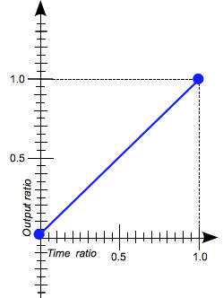

import { TwitterTweetEmbed as Tweet } from 'react-twitter-embed';
import { Flex, Box } from '@rebass/emotion';
import { Split } from 'mdx-deck/layouts';

export { theme } from './components/theme';
import { Reference } from './components/Reference';
import { ThemeGlobal } from './components/theme';
import { BasicAnimation } from './components/BasicAnimation';
import { LinearInterpolationChart } from './components/LinearInterpolationChart';
import { AnimatingProperties } from './components/AnimatingProperties';
import { BezierCurveDevtools } from './components/BezierCurveDevtools';
import { Keyframes } from './components/Keyframes';
import { SlideCss } from './components/SlideCss';
import { SlideSpring } from './components/SlideSpring';
import { SpringPresets } from './components/SpringPresets';
import { UnmountAnimation } from './components/UnmountAnimation';
import { AutoAnimation } from './components/AutoAnimation';

<ThemeGlobal />

# Animating React :D

Axel Hernández Ferrera ([@axelhzf](https://twitter.com/axelhzf))

---

# Agenda

- Why Animations?
- CSS Animations
- Spring Based Animations
- Experiments

---

# Disclamer:

## I am not a motion designer

---

Why native feels better than web apps?

---

Animations using SwiftUI

<Tweet tweetId="1142539362875392001" />

---

The tools for native animations are superior

<Tweet tweetId="1145465025194332165" />

---

# Why animation matters?

TODO improve

---

### CSS Animations

---

CSS transition

    div {
        transition:
            <property>
            <duration>
            <timing-function>
            <delay>
        ;
    }

---

<BasicAnimation />

---

### Animated Properties

<AnimatingProperties />

<Reference href="https://developer.mozilla.org/en-US/docs/Web/CSS/CSS_animated_properties">
  CSS Animated Properties
</Reference>

---

### Timing functions

<Flex>
<Flex flexDirection="column">

linear

</Flex>

<Flex flexDirection="column">

ease

</Flex>
<Flex flexDirection="column">

ease-in

</Flex>
<Flex flexDirection="column">

ease-out

</Flex>
<Flex flexDirection="column">

ease-in-out

</Flex>
</Flex>

<Reference href="https://developer.mozilla.org/en-US/docs/Web/CSS/timing-function">
  MDN Timing Functions
</Reference>

---

## cubic-bezier

A Bézier curve is a parametric curve used to model smooth curves

 
 

<Reference href="https://en.wikipedia.org/wiki/B%C3%A9zier_curve#Cubic_B.C3.A9zier_curves">
  Bezier Curves in Wikipedia
</Reference>

---

## ease-in-out

    cubic-bezier(0.42, 0.0, 0.58, 1.0)

---

Cubic-bezier playground

https://cubic-bezier.com

---

Devtools

<BezierCurveDevtools />

---

Keyframes animations

<Keyframes />

---

Keyframes are powerful

[https://codepen.io/davidkpiano/pen/kkpGWj](https://codepen.io/davidkpiano/pen/kkpGWj)

---

<SlideCss />

---

<Tweet tweetId="566736015188963328" />

---

<video
  autoPlay={true}
  loop={true}
  muted
  style={{ width: '100vw', height: '100vh' }}
>
  <source src="assets/carbonMotionDuration.mp4" type="video/mp4" />
</video>

<Reference href="https://www.carbondesignsystem.com/guidelines/motion/basics#duration">
  IBM Carbon Design System Motion
</Reference>

---

<SlideSpring />

---

Spring based animations

[Cheng Lou - the state of animation in React](https://www.youtube.com/watch?v=1tavDv5hXpo)

---

Spring based animations

- I don't care about the current position. Give me the final value, I know the current momentum
- Conserve the current animation's speed for me
- Here the stiffness, damping and mass of this thing

<Reference href="https://www.youtube.com/watch?v=1tavDv5hXpo">
  The state of animation in React
</Reference>

---

### Spring Physics

Hooke’s law expresses how springs extends and contract

The force is proportional to the extension

<Reference href="https://en.wikipedia.org/wiki/Hooke%27s_law#For_linear_springs">
  Hooke's law Wikipedia
</Reference>

---

### Spring Physics

There’s also this damping force which slows down the motion. Without it, the spring will keep oscillating forever.

Ff = −cv

<Reference href="https://en.wikipedia.org/wiki/Damping_ratio#Example:_mass.E2.80.93spring.E2.80.93damper">
  Dumping Force Wikipedia
</Reference>

---

### Spring Physics

<Reference href="https://en.wikipedia.org/wiki/Harmonic_oscillator#Damped_harmonic_oscillator">
  Harmonic Oscillator Wikipedia
</Reference>

---

### Spring Presets

<SpringPresets />

<Reference href="https://www.react-spring.io/docs/hooks/api">
  React Spring Api
</Reference>

---

### Unmount Animations

<UnmountAnimation />

---

Auto Animations

<AutoAnimation />

---

### Trail Animations

---

### Chain Animations

---

> Animation is like cursing: If you overuse it, it loses all its impact.
