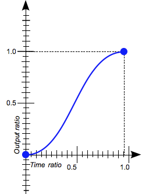

import { TwitterTweetEmbed as Tweet } from 'react-twitter-embed';
export { theme } from './components/theme'
import { Reference } from './components/Reference'
import { ThemeGlobal } from './components/theme'
import { BasicAnimation } from './components/BasicAnimation';
import { LinearInterpolationChart } from './components/LinearInterpolationChart';
import { AnimatingProperties } from './components/AnimatingProperties';
import { BezierCurveDevtools } from './components/BezierCurveDevtools';
import { Flex, Box } from '@rebass/emotion';

<ThemeGlobal/>

# Animating React
 Axel Hernández Ferrera ([@axelhzf](https://twitter.com/axelhzf))

---

# Agenda

* Why Animations?
* CSS Animations
* Spring Based Animations
* Experiments

---

# Disclamer:
## I am not a motion designer

---

Why native feels better than web apps?

---

Animations using SwiftUI

<Tweet tweetId="1142539362875392001" />

---

The tools for native animations are superior

<Tweet tweetId="1145465025194332165" />

---

# Why animation matters?

TODO improve

---

### CSS Animations

---

CSS transition

    div {
        transition:
            <property>
            <duration>
            <timing-function>
            <delay>
        ;
    }

---

<BasicAnimation/>

---

### Animated Properties

<AnimatingProperties/>

<Reference href="https://developer.mozilla.org/en-US/docs/Web/CSS/CSS_animated_properties">CSS Animated Properties</Reference>

---

### Timing functions

<Flex>
<Flex flexDirection="column">

linear

</Flex>

<Flex flexDirection="column">

ease

</Flex>
<Flex flexDirection="column">

ease-in

</Flex>
<Flex flexDirection="column">

ease-out

</Flex>
<Flex flexDirection="column">

ease-in-out

</Flex>
</Flex>

<Reference href="https://developer.mozilla.org/en-US/docs/Web/CSS/timing-function">MDN Timing Functions</Reference>

---

## cubic-bezier

A Bézier curve is a parametric curve used to model smooth curves

 
 

<Reference href="https://en.wikipedia.org/wiki/B%C3%A9zier_curve#Cubic_B.C3.A9zier_curves">Bezier Curves in Wikipedia</Reference>

---

## ease-in-out

    cubic-bezier(0.42, 0.0, 0.58, 1.0)

---

Cubic-bezier playground

https://cubic-bezier.com

---

Devtools

<BezierCurveDevtools/>

---

> Animation is like cursing: If you overuse it, it loses all its impact.

